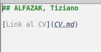
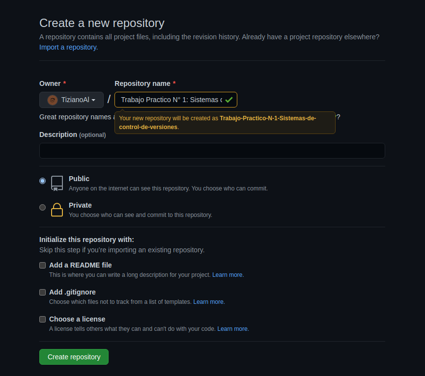

Trabajo Práctico N° 1: Sistemas de control de versiones.
========================
### ALFAZAK, Tiziano

# 1 - Instalar Git

```
alfazak@alfazak-Lenovo-Y520-15IKBN:~$ git version
git version 2.25.1
```

# 2 - Crear un repositorio local y agregar archivos

```
alfazak@alfazak-Lenovo-Y520-15IKBN:~/Escritorio/7°/Aplicación de Nuevas Tecnologías/Tp1$ git init
Inicializado repositorio Git vacío en /home/alfazak/Escritorio/7°/Aplicación de Nuevas Tecnologías/Tp1/.git/
```

```
alfazak@alfazak-Lenovo-Y520-15IKBN:~/Escritorio/7°/Aplicación de Nuevas Tecnologías/Tp1$ touch README.md

alfazak@alfazak-Lenovo-Y520-15IKBN:~/Escritorio/7°/Aplicación de Nuevas Tecnologías/Tp1$ touch CV.md
```



```
alfazak@alfazak-Lenovo-Y520-15IKBN:~/Escritorio/7°/Aplicación de Nuevas Tecnologías/Tp1$ git add .

alfazak@alfazak-Lenovo-Y520-15IKBN:~/Escritorio/7°/Aplicación de Nuevas Tecnologías/Tp1$ git commit -m "Creacion README.md y CV.md"
[master (commit-raíz) 8e466cf] Creacion README.md y CV.md
 2 files changed, 6 insertions(+)
 create mode 100644 CV.md
 create mode 100644 README.md
```

# 3 - Crear un repositorio remoto




# 4 - Familiarizarse con el concepto de Pull Request

```
alfazak@alfazak-Lenovo-Y520-15IKBN:~/Escritorio/7°/Aplicación de Nuevas Tecnologías/Tp1$ git checkout -b localBranch
Cambiado a nueva rama 'localBranch'
```

```
alfazak@alfazak-Lenovo-Y520-15IKBN:~/Escritorio/7°/Aplicación de Nuevas Tecnologías/Tp1$ touch Pullrequest.md
```


# 5 - Mergear código con conflictos


```
alfazak@alfazak-Lenovo-Y520-15IKBN:~/Escritorio/7°/Aplicación de Nuevas Tecnologías/Tp1 Clone$ git clone https://github.com/TizianoAl/Trabajo-Practico-N-1-Sistemas-de-control-de-versiones.git
Clonando en 'Trabajo-Practico-N-1-Sistemas-de-control-de-versiones'...
remote: Enumerating objects: 9, done.
remote: Counting objects: 100% (9/9), done.
remote: Compressing objects: 100% (8/8), done.
remote: Total 9 (delta 0), reused 8 (delta 0), pack-reused 0
Desempaquetando objetos: 100% (9/9), 2.53 KiB | 647.00 KiB/s, listo.
```


```
alfazak@alfazak-Lenovo-Y520-15IKBN:~/Escritorio/7°/Aplicación de Nuevas Tecnologías/Tp1$ git status
En la rama main
Tu rama está actualizada con 'origin/main'.

Cambios no rastreados para el commit:
  (usa "git add <archivo>..." para actualizar lo que será confirmado)
  (usa "git restore <archivo>..." para descartar los cambios en el directorio de trabajo)
	modificado:     CV.md

sin cambios agregados al commit (usa "git add" y/o "git commit -a")

alfazak@alfazak-Lenovo-Y520-15IKBN:~/Escritorio/7°/Aplicación de Nuevas Tecnologías/Tp1$ git add . 
alfazak@alfazak-Lenovo-Y520-15IKBN:~/Escritorio/7°/Aplicación de Nuevas Tecnologías/Tp1$ git commit -m "Cambio 1"
[main 87454b4] Cambio 1
 1 file changed, 3 insertions(+), 1 deletion(-)
 
alfazak@alfazak-Lenovo-Y520-15IKBN:~/Escritorio/7°/Aplicación de Nuevas Tecnologías/Tp1$ git push -u origin main
Username for 'https://github.com': TizianoAl
Password for 'https://TizianoAl@github.com': 
Enumerando objetos: 9, listo.
Contando objetos: 100% (8/8), listo.
Compresión delta usando hasta 4 hilos
Comprimiendo objetos: 100% (5/5), listo.
Escribiendo objetos: 100% (5/5), 682 bytes | 682.00 KiB/s, listo.
Total 5 (delta 1), reusado 0 (delta 0)
remote: Resolving deltas: 100% (1/1), completed with 1 local object.
To https://github.com/TizianoAl/Trabajo-Practico-N-1-Sistemas-de-control-de-versiones.git
   92dfc7f..da7066f  main -> main
Rama 'main' configurada para hacer seguimiento a la rama remota 'main' de 'origin'.
```


```
alfazak@alfazak-Lenovo-Y520-15IKBN:~/Escritorio/7°/Aplicación de Nuevas Tecnologías/Tp1 Clone/Trabajo-Practico-N-1-Sistemas-de-control-de-versiones$ git status
En la rama main
Tu rama está actualizada con 'origin/main'.

Cambios no rastreados para el commit:
  (usa "git add <archivo>..." para actualizar lo que será confirmado)
  (usa "git restore <archivo>..." para descartar los cambios en el directorio de trabajo)
	modificado:     CV.md

sin cambios agregados al commit (usa "git add" y/o "git commit -a")
```


- LOCAL es la version local de la rama
- REMOTE es la version remota de la rama
- BASE es una version de la rama con el merge a medio terminar donde los conflictos estan marcados:


El codigo entre <<<< HEAD y ===== es lo que existe en la version local

El codigo entre ===== y >>>> es lo que existe en la version remota


# 6 - Algunos ejercicios online


# 7 - Crear Repositorio de la materia


